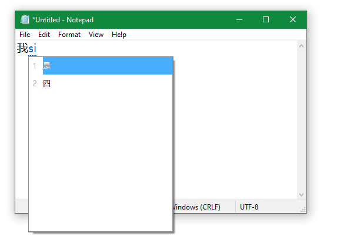

# Lannang-ue IME
A keyboard input support for Philippine Hokkien (Lannang-ue) for Windows.

## Download

> **DO NOT** download from other sources, they may contain **virus** and considered **unsafe** and **malicious**.

~~**Download 32-bit:** Lannang-ue_IME_v1.0_32bit.zip~~ (Currently not available)

**Download 64-bit:** [Lannang-ue_IME_v1.0_64bit.zip](https://github.com/MystWalkerOfficial/LannangUeIME/releases/download/v1.0/Lannang-ue_Dev_Release_v1.0_WIN64.zip)
 ## Tested Windows Versions:
 - [ ] Windows 11
 - [x] Windows 10
 - [ ] Windows 8
 - [ ] Windows 7
## Future Plans:
 - [ ] Pressing numbers to select an entry from suggestions.
 - [ ] Options window for configuring and customizing the keyboard.
 - [ ] Show description for the selected character
 - [ ] Complete the DICTIONARY file
